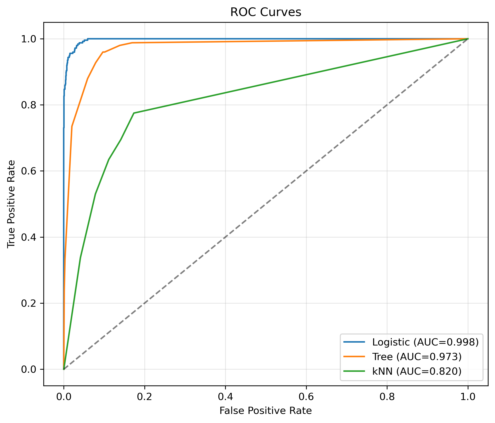
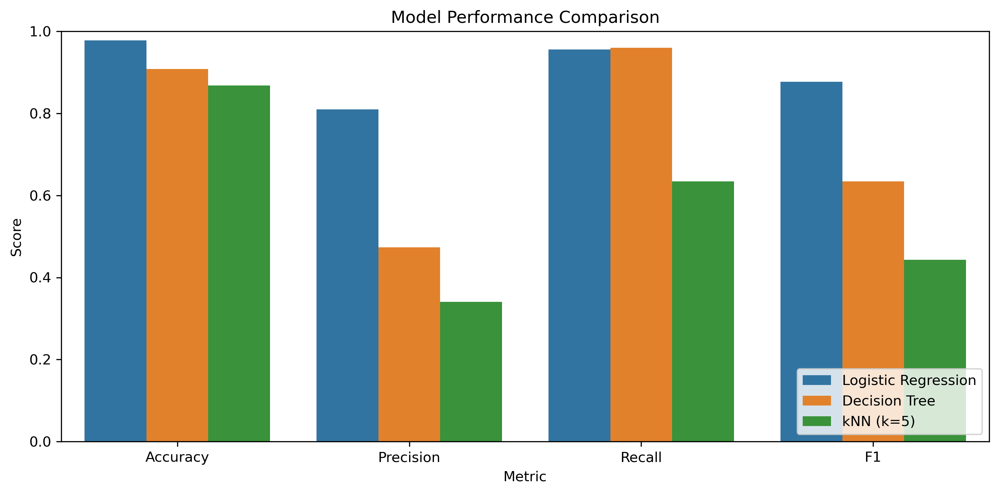
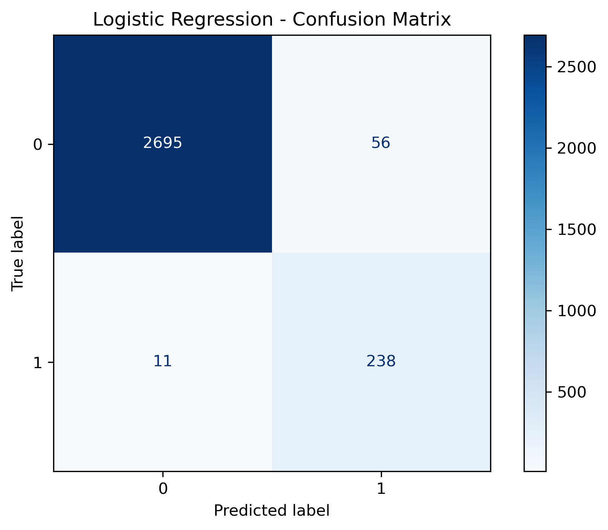

# Healthcare Fraud Detection

*A machine learning case study for identifying potentially fraudulent healthcare insurance claims using Python and supervised learning.*

---

##  Executive Summary

Healthcare fraud costs insurers billions of dollars each year while increasing premiums and slowing legitimate claim processing. This project develops and evaluates machine learning models to identify potentially fraudulent healthcare insurance claims and support investigator prioritization.

Using a dataset of **10,000 healthcare insurance claims**, I built and compared three supervised learning models:

- Logistic Regression
- Decision Tree
- K-Nearest Neighbors (kNN)

After preprocessing the data and addressing class imbalance using random oversampling, **Logistic Regression** achieved the strongest overall performance and was selected as the recommended model for investigator prioritization.

---

##  Business Problem

Insurance companies process thousands of healthcare claims every day.

Reviewing every claim manually is expensive and impractical, while allowing fraudulent claims to pass through increases costs for insurers and policyholders.

The objective of this project was to develop a machine learning model capable of identifying claims most likely to be fraudulent so investigators can focus their attention where it provides the greatest value.

---

##  Dataset

**Source:** Kaggle Healthcare Fraud Detection Dataset

**Records:** 10,000 healthcare insurance claims

**Target Variable:** `Is_Fraud`

**Fraud Rate:** Approximately **8.3%**

The dataset combines:

- Patient demographics
- Diagnosis information
- Provider characteristics
- Claim amounts
- Approved amounts
- Visit history
- Healthcare claim attributes

---

##  Project Workflow

- Data Cleaning & Preprocessing
- Missing Value Treatment
- Feature Engineering
- Class Imbalance Handling (Random Oversampling)
- Exploratory Data Analysis (EDA)
- Model Development
- Model Evaluation
- Business Interpretation

---

##  Machine Learning Models

The following supervised learning algorithms were evaluated:

- Logistic Regression
- Decision Tree
- K-Nearest Neighbors (kNN)

Models were evaluated using:

- Precision
- Recall
- F1 Score
- ROC-AUC

### ROC Curve

*Figure 1. ROC curves comparing the classification performance of the three evaluated machine learning models.*

---
##  Key Results

### Best Performing Model

**Logistic Regression**

*Figure 2. Comparison of accuracy, precision, recall, and F1 score across the evaluated machine learning models.*

Key results:

- Recall: **95.6%**
- Precision: **81.0%**
- F1 Score: **0.877**
- ROC-AUC: **0.998**

Key findings included:

- High fraud detection recall
- Strong precision for investigator prioritization
- Competitive F1 score
- Model behavior aligned with domain intuition rather than random correlations

The analysis also identified important fraud indicators, including differences between billed and approved amounts, claim submission timing, and provider characteristics.

These findings demonstrate how machine learning can help insurers focus investigative resources on the highest-risk claims while reducing unnecessary manual review.

---

##  Business Impact

### Logistic Regression Confusion Matrix

*Figure 3. Confusion matrix for the selected Logistic Regression model on the test dataset.*

Rather than replacing investigators, this model is designed to support them by prioritizing claims with the highest probability of fraud.

Potential business benefits include:

- Faster fraud investigations
- Reduced manual review workload
- Improved operational efficiency
- Lower financial losses
- Explainable predictions suitable for human review

Because Logistic Regression produces probabilities, investigators could prioritize the most suspicious claims first rather than treating every flagged claim equally.

---

## Repository Contents

| File | Purpose |
|------|-------------|
| `Healthcare_Fraud_Detection.ipynb` | Complete end-to-end machine learning analysis |
| `healthcare_fraud_detection.csv` | Healthcare claims dataset |
| `Project_Report.pdf` | Full technical report |
---

## Technologies

### Programming

- Python

### Data Analysis

- Pandas
- NumPy

### Machine Learning

- scikit-learn
- imbalanced-learn

### Data Visualization

- Matplotlib
- Seaborn
---

## Key Takeaways

- Demonstrated end-to-end machine learning workflow
- Addressed class imbalance using random oversampling
- Compared multiple supervised learning models
- Connected technical findings to real business decision-making
- Produced an interpretable fraud detection model suitable for investigator prioritization

---

